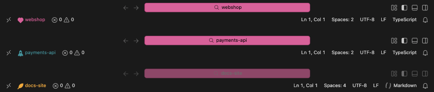
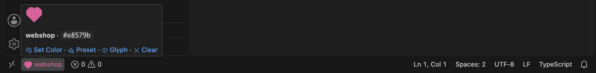
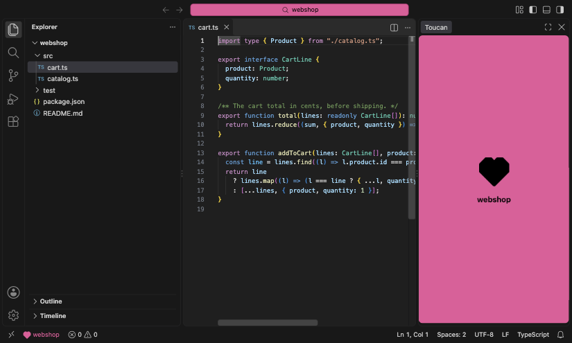
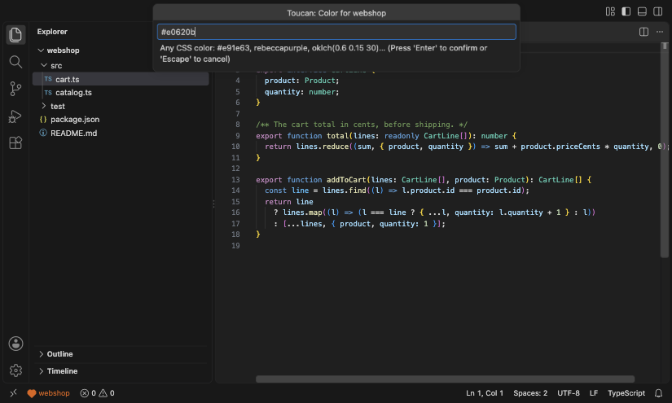
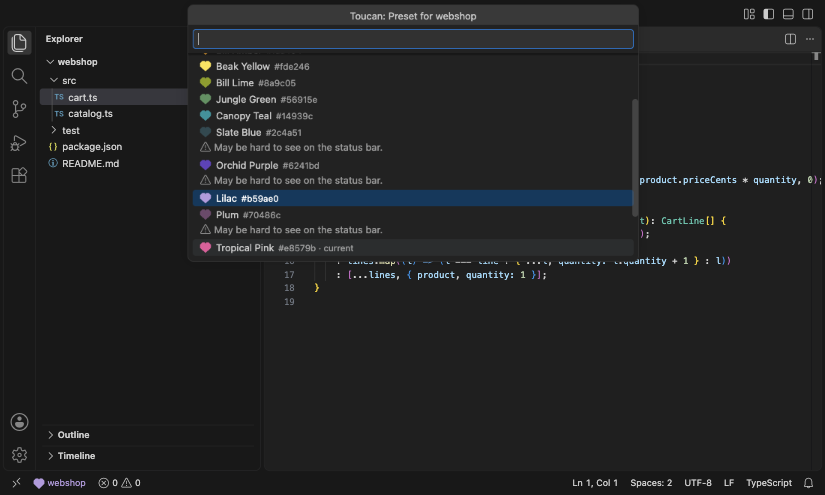
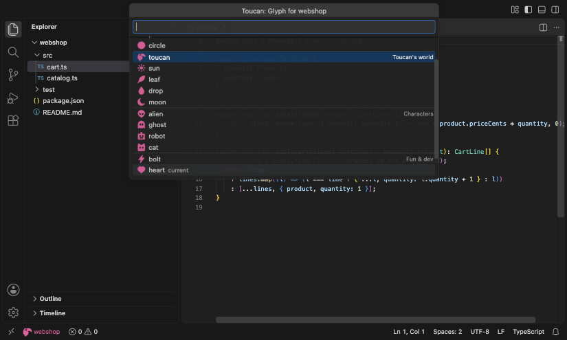
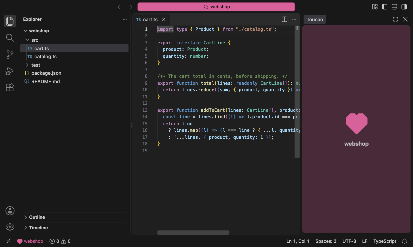

# Toucan

See at a glance which repository a VS Code window has open, in the spirit of Peacock and Kingfisher. Colors are configured once, by repository name, in your own user settings. Toucan never writes anything into the opened repository.



- The Command Center (the search bar in the title bar) takes the focused window's repository color.
- Every window, focused or not, shows a glyph and the repository name in that color on the status bar.
- Opt-in extras: a color block in the secondary sidebar, and an experimental colored emoji in the search bar.
- One setting for every repository you open, set through commands with a live preview, or by hand.

> Status: in development. Not on the Marketplace yet; install it from a local VSIX.

## Features

VS Code has no per-window color API, so Toucan layers a few signals. Repositories without a Toucan color get none of them.

### Command Center color


The Command Center takes the focused window's repository color. Toucan writes it to your user-level `workbench.colorCustomizations` when a window gains focus, and that setting is shared by every window: the other windows' Command Centers show the same color, dimmed while they're unfocused. Each window's own color stays on its status bar, and on its sidebar block or search emoji if those are on. Switching to another window with a Toucan color replaces it at once; a window whose repository has no color clears it, and so does leaving VS Code, after a short delay. The other Command Center colors (text, hover, border, the unfocused look) are derived from the background so they stay readable; [`toucan.repos`](#toucanrepos) can override any of them.

### Status bar indicator



Every window shows the repository's glyph and name on the left of the status bar, in the repository color. It needs no settings write, so it works in windows that aren't focused. Click it to set a color, or hover it for a swatch, the color and links to Set Color, Preset, Glyph and Clear.

### Sidebar block



An opt-in block in the secondary sidebar shows the repository's glyph large, with its name underneath, in the repository color. Turn it on with [`toucan.sidebarBlock.enabled`](#toucansidebarblockenabled) or [Toggle Sidebar Block](#toggle-sidebar-block), choose how strongly it's colored with [`toucan.sidebarBlock.style`](#toucansidebarblockstyle), and when it shows with [`toucan.sidebarBlock.visibility`](#toucansidebarblockvisibility).

When the block goes off (its repository loses its color, or you turn the setting off), Toucan closes the secondary sidebar only if it opened it itself, which only happens in `unfocused` mode. A secondary sidebar you opened stays open.

### Search emoji (experimental)


Turn on [`toucan.experimental.searchEmoji`](#toucanexperimentalsearchemoji) for a colored emoji in the Command Center label, in every window, focused or not. It relies on internal VS Code behavior that may break in any release.

- **Consent.** It needs two variables of its own, `${toucanRepoLead}` and `${toucanRepoEmoji}`, in your `window.title`, so Toucan asks once before changing that setting in your user settings. Declining turns the emoji off again. A workspace that sets its own `window.title` won't show the emoji.
- **The look.** The emoji leads the label while a file is open ("🟦 file.ts — webshop") and sits in front of the folder name when none is ("🟦 webshop"). It's the nearest of nine colored squares to the repository color; the circle glyph gets circles and the heart glyph gets hearts.
- **Restore.** Turning the emoji off restores your previous `window.title`, unless you've edited it since.
- **Uninstall.** If Toucan is disabled or uninstalled with the emoji still on, the two variables stay empty: the title shows no emoji and no repeated name, and you can remove them from your settings whenever you like.
- **Your own `${activeRepositoryName}`.** If your own `window.title` uses `${activeRepositoryName}`, it now shows source control's repository name again, as without Toucan; Toucan asks to add its own variable in front.

### The agents control offer

In VS Code 1.139, the experimental setting `chat.agentsControl.enabled` defaults to `"compact"`, which replaces the Command Center with an agent status box that has no background. Toucan can then only color its border and text. Set it to `"badge"` (keeps the agent badge) or `"hidden"` for the full color. Toucan offers to switch it to `"badge"` until you answer, and never changes it without asking. If you choose _Not now_, it doesn't ask again in that profile; closing the notification asks again in a later session. When a workspace sets the setting itself, Toucan doesn't ask.

## Commands

Run them from the Command Palette, or from the status bar item: click it for Set Color, hover it for the rest.

| Command                             | What it does                                                               |
| ----------------------------------- | -------------------------------------------------------------------------- |
| **Toucan: Set Color for This Repo** | Type any CSS color, with a live preview on the status bar                  |
| **Toucan: Pick Preset Color**       | Pick one of 16 toucan-themed colors, with a live preview                   |
| **Toucan: Set Glyph**               | Pick the status bar glyph, one of 17 in four groups                        |
| **Toucan: Clear Color**             | Remove this repository's entry, asking first if it holds more than a color |
| **Toucan: Toggle Sidebar Block**    | Show or hide the sidebar block, offering to turn it on                     |

### Set Color



**Toucan: Set Color for This Repo** takes any CSS color: `#e91e63`, `rebeccapurple`, `oklch(0.6 0.15 30)`. The status bar previews it as you type; nothing is saved until you press Enter, and Escape leaves the saved color as it was. The color must be opaque. It warns when a color may be hard to see on the status bar, without stopping you from saving it.

### Pick Preset Color



**Toucan: Pick Preset Color** offers 16 toucan-themed colors, each with a swatch in the repository's glyph, and previews the one you're on. The current color is marked, and so is any preset that may be hard to see on the status bar. A picked preset is stored as its hex color.

### Set Glyph



**Toucan: Set Glyph** picks the status bar shape, previewed as you move through the list: one of 17 in Toucan's own style, in four groups. Shapes: square, bar, pill, circle. Toucan's world: toucan, sun, leaf, drop, moon. Characters: alien, ghost, robot, cat. Fun & dev: bolt, heart, star, rocket. The default is `square`. A repository needs a color first.

### Clear Color


**Toucan: Clear Color** removes the repository's entry from `toucan.repos`. If the entry holds more than a color (overrides, a glyph, a sidebar setting), it asks first and lists them. When the last entry goes, the `toucan.repos` setting goes with it, and so does Toucan's part of `workbench.colorCustomizations`: an empty setting isn't left behind, unless a comment of yours is inside it.

### Toggle Sidebar Block


**Toucan: Toggle Sidebar Block** shows or hides the [sidebar block](#sidebar-block). If the block is turned off, it offers to turn it on. Closing the block this way counts as your own close in `always` mode, and opening it again forgets that close. A repository needs a color first.

## Settings

All of Toucan's settings apply from user settings only, never from a repository's `.vscode/settings.json`, and they are shared across all VS Code profiles.

### toucan.repos

Colors per repository, keyed by workspace folder name: the directory name, or the `name` a `.code-workspace` file gives the folder. In a multi-root window, the first folder is used. Repositories without an entry get no colors. The commands above write this setting for you; you can also edit it by hand.

```jsonc
// user settings.json
"toucan.repos": {
  "webshop": "#e91e63",          // a color string sets the background, the rest is derived
  "toucan": {
    "background": "#1b5e20",   // required
    "foreground": "#ffffff",   // optional overrides
    "glyph": "heart",          // optional, default "square"
    "sidebarBlock": "unfocused"
  }
}
```

A value is either a color string, the Command Center background with everything else derived, or an object:

- `background` (required): the Command Center background.
- `foreground`, `activeBackground`, `activeForeground`, `border`, `activeBorder`, `inactiveForeground`, `inactiveBorder` (optional): override the Command Center's derived `commandCenter.*` colors. Colors derived from one you override build on your value.
- `glyph` (optional): the status bar glyph, default `square` (see [Set Glyph](#set-glyph)).
- `sidebarBlock` (optional): `always` or `unfocused`, overriding [`toucan.sidebarBlock.visibility`](#toucansidebarblockvisibility) for this repository.

### toucan.sidebarBlock.enabled


Shows the [sidebar block](#sidebar-block) in the secondary sidebar, for repositories with a color. Off by default.

### toucan.sidebarBlock.style



How strongly the sidebar block is colored: `full` (default) is the solid repository color, as in the [sidebar block](#sidebar-block) image; `muted` is a faint tint with the glyph in full color and the name in the theme's text color.

### toucan.sidebarBlock.visibility


When the sidebar block is shown. A repository's own `sidebarBlock` in [`toucan.repos`](#toucanrepos) overrides it.

- `always` (default) reveals the block on startup. Once you close it, or switch the secondary sidebar to another view, it stays closed in this workspace until you open it again with Toggle Sidebar Block.
- `unfocused` reveals it when the window loses focus, and closes the secondary sidebar again on focus if Toucan opened it. If another view such as Chat was open in the secondary sidebar, it is closed too.

### toucan.experimental.searchEmoji


Shows the [search emoji](#search-emoji-experimental) in the Command Center label. Off by default. Toucan asks before it changes `window.title`.

### All settings

<!-- configs -->

| Key                               | Description                                                                                                                                                                                                           | Type      | Default    |
| --------------------------------- | --------------------------------------------------------------------------------------------------------------------------------------------------------------------------------------------------------------------- | --------- | ---------- |
| `toucan.repos`                    | Colors per repository, keyed by workspace folder name. A value is either a color string (the Command Center background; everything else is derived) or an object with a required `background` and optional overrides. | `object`  | `{}`       |
| `toucan.sidebarBlock.enabled`     | Show a block in the repository color in the secondary sidebar.                                                                                                                                                        | `boolean` | `false`    |
| `toucan.sidebarBlock.style`       | How strongly the sidebar block is colored.                                                                                                                                                                            | `string`  | `"full"`   |
| `toucan.sidebarBlock.visibility`  | When the sidebar block is shown. Each repository can override this in `toucan.repos`.                                                                                                                                 | `string`  | `"always"` |
| `toucan.experimental.searchEmoji` | **Experimental.** Show a colored emoji in the Command Center label. Changes `window.title` (Toucan asks first) and relies on internal VS Code behavior that may break in any release.                                 | `boolean` | `false`    |

<!-- configs -->

## Good to know

Toucan owns every top-level `commandCenter.*` key in your user-level `workbench.colorCustomizations` and never touches other keys. Any `commandCenter.*` colors you had there before installing Toucan stay until Toucan first applies a color in that profile. From then on they are replaced on focus and removed when a window clears its color, so copy them somewhere first if you want to keep them.

Theme-scoped blocks such as `"[Default Dark Modern]": { "commandCenter.background": … }` are yours and Toucan leaves them alone. VS Code applies them on top of the top-level keys, so while that theme is active they override Toucan's Command Center colors.

With Settings Sync, the focus colors can reach other machines, where nothing may clear them. Add `"settingsSync.ignoredSettings": ["workbench.colorCustomizations"]` to keep them local (this also stops syncing your other color customizations).

Toucan edits `toucan.repos` and its `commandCenter.*` keys in place, so comments in your settings file survive. In a few cases it falls back to VS Code's own settings write, which drops comments inside that setting: when the setting isn't in the file yet, while your settings file has unsaved changes, with an unusual profile layout, or when you switch windows in the second before VS Code has picked up the previous window's change.

With profiles that share settings but keep separate global state, windows in different profiles don't know about each other. Switching between them can briefly clear the Command Center color before the focused window applies it again.

If a window crashes while focused and you uninstall Toucan before opening VS Code again, its `commandCenter.*` colors stay in your settings. Remove those keys from `workbench.colorCustomizations` by hand.

## Install

```sh
corepack pnpm install
corepack pnpm package
code --install-extension toucan-*.vsix
```

## Development

Requires Node 24 (see `.nvmrc`) and pnpm through corepack.

| Command                | What it does                                                                        |
| ---------------------- | ----------------------------------------------------------------------------------- |
| `pnpm lint`            | Lint with oxlint, with type information; any finding fails                          |
| `pnpm format:check`    | Check formatting with oxfmt (`pnpm format` to fix)                                  |
| `pnpm typecheck`       | Typecheck with TypeScript 7                                                         |
| `pnpm test`            | Run the unit tests with vitest                                                      |
| `pnpm build`           | Bundle `dist/extension.cjs` with tsdown                                             |
| `pnpm gen`             | Regenerate `src/generated/meta.ts` and the settings table above from `package.json` |
| `pnpm font`            | Bake the glyph designs into paths and rebuild the glyph font in `media/`            |
| `pnpm icon`            | Render the extension icon `media/icon.png` from `media/toucan-icon.svg`             |
| `pnpm screenshots`     | Regenerate the README images in `media/readme/`                                     |
| `pnpm check:generated` | Regenerate everything above and fail if anything changed (CI runs this)             |
| `pnpm package`         | Build and package a VSIX                                                            |
| `pnpm docs:index`      | Register the docs with qmd and refresh its index and embeddings (see below)         |
| `pnpm mutate [file…]`  | StrykerJS mutation testing of the given files, or all but `scripts/qmd`; on demand  |
| `/docs-sync`           | Claude Code skill: report doc drift since the last run, with a fix per item         |

`pnpm install` also sets up a pre-push hook (husky) that runs `typecheck`, `lint`, `format:check` and `test`. It's set up per checkout, so run `pnpm install` in a new worktree before pushing from it. `HUSKY=0` skips it; CI skips it and runs the full set itself.

### Docs search with qmd

[qmd](https://github.com/tobi/qmd) gives local keyword and semantic search over the docs, and it's part of the setup for working on Toucan: agents search the docs with it instead of reading whole folders, which finds things far better. Claude Code sessions in this repo use it through `.mcp.json`. The extension itself doesn't need it, and CI never installs it.

Toucan keeps its docs in its own qmd index, `toucan`, so it never touches your other qmd collections. Search it yourself with `qmd --index toucan query "…"`.

One-time setup:

1. Install qmd 2.8 or newer: `npm i -g @tobilu/qmd`. Do this under the Node version your editor and Claude Code use (with nvm, run it while that version is active), so `qmd` is on their `PATH`.
2. If npm says it skipped install scripts, try qmd anyway: the prebuilt binaries usually work. If they don't, reinstall with `--allow-scripts=` followed by the packages npm lists in its warning, comma-separated. The list depends on the qmd version; e.g., for qmd 2.8.3: `npm i -g @tobilu/qmd --allow-scripts=node-llama-cpp,tree-sitter-go,tree-sitter-python,tree-sitter-rust,tree-sitter-typescript,tree-sitter-javascript`.
3. Check it: `qmd --version` prints 2.8 or newer, and `command -v qmd` prints its path.
4. Start a Claude Code session here. A session-start hook registers Toucan's two collections, `toucan-docs` (`docs/`) and `toucan-guides` (README.md and GROUNDING.md), and builds the keyword index in the background.
5. The first search or `pnpm docs:index` downloads qmd's models (about 2 GB, one-time); that's expected and well worth it.
6. Run `pnpm docs:index` once for full embeddings (semantic search). It's safe to rerun. If the collections already point at another checkout that still exists, it leaves them alone unless you pass `--force`.

After that, a hook keeps keyword search fresh whenever a doc is edited. Run `pnpm docs:index` again after bigger doc changes, to refresh the embeddings.

The index points at the checkout that registered it, so a search from another worktree sees that checkout's docs.

## License

[MIT](LICENSE)

Bundled third-party code and its licenses are listed in [THIRD_PARTY_NOTICES.md](THIRD_PARTY_NOTICES.md).
