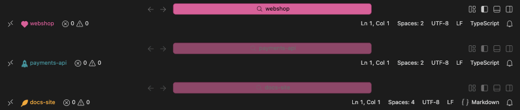
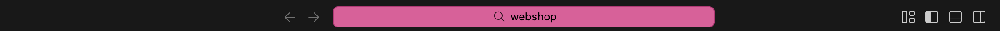
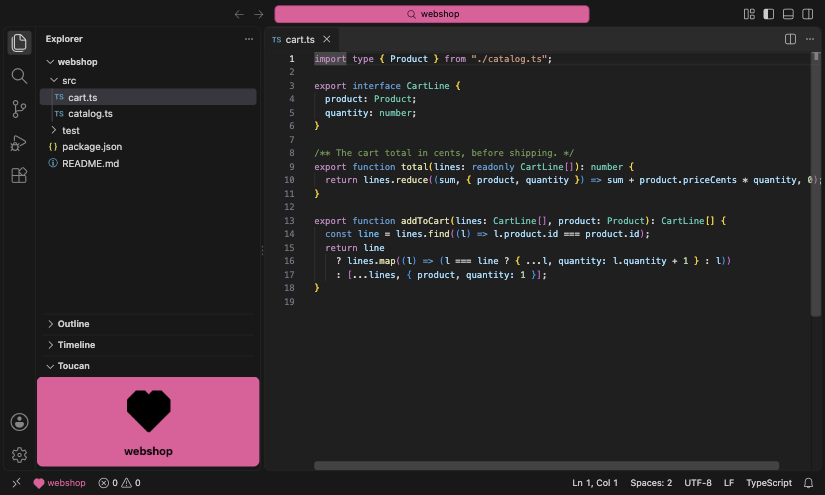
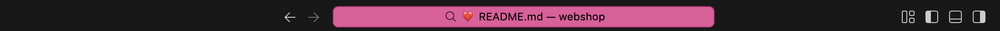
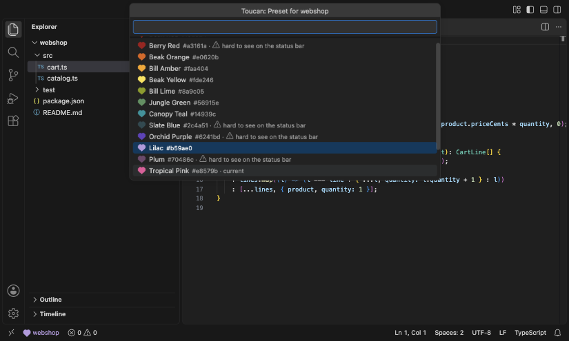
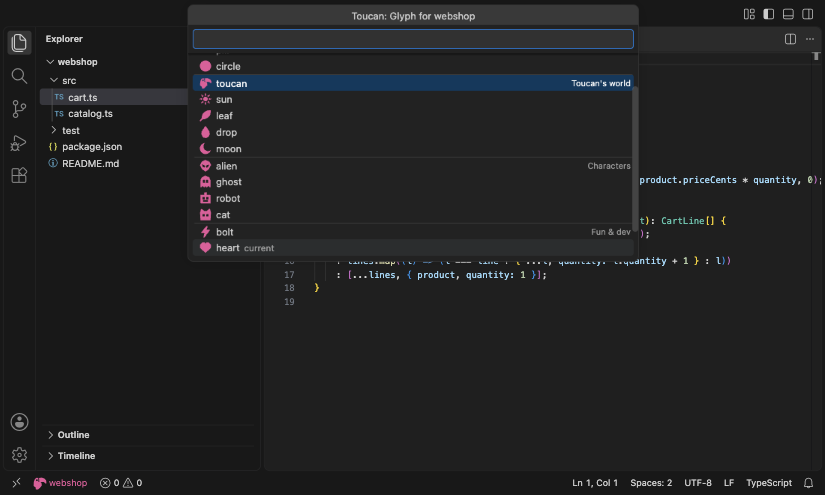
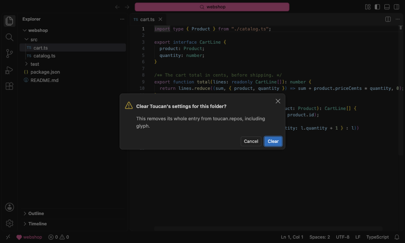
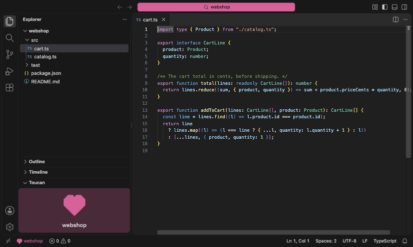

# Toucan

Color-code your VS Code windows by repository, and see at a glance which one you're in. In the spirit of Peacock and Kingfisher, colors are configured once, by repository name, in your own user settings. Toucan never writes anything into the opened repository.



_The Command Center follows the focused window; the status bar always shows each window's own color._

- The Command Center (the search bar in the title bar) takes the focused window's repository color.
- Every window, focused or not, shows a glyph and the repository name in that color on the status bar.
- Opt-in extras: a color block in the Explorer, and an experimental colored emoji in the search bar.
- One setting for every repository you open, set through commands with a live preview, or by hand.

## Features

VS Code has no per-window color API, so Toucan layers a few signals. Repositories without a Toucan color get none of them.

### Command Center color



The Command Center takes the focused window's repository color. Toucan writes it to your user-level `workbench.colorCustomizations` when a window gains focus, and that setting is shared by every window: the other windows' Command Centers show the same background, with their text and border dimmed while they're unfocused. Each window's own color stays on its status bar, and on its sidebar block or search emoji if those are on. Switching to another window with a Toucan color replaces it at once; a window whose repository has no color clears it, and so does leaving VS Code, after a short delay. The other Command Center colors (text, hover, border, the unfocused look) are derived from the background so they stay readable; [`toucan.repos`](#toucanrepos) can override any of them.

### Status bar indicator


Every window shows the repository's glyph and name on the left of the status bar, in the repository color. It needs no settings write, so it works in windows that aren't focused. Click it to set a color, or hover it for a swatch, the color and links to Set Color, Preset, Glyph and Clear.

### Sidebar block



An opt-in block in the Explorer shows the repository's glyph large, with its name underneath, in the repository color. Turn it on with [`toucan.sidebarBlock.enabled`](#toucansidebarblockenabled) or [Toggle Sidebar Block](#toggle-sidebar-block), and choose how strongly it's colored with [`toucan.sidebarBlock.style`](#toucansidebarblockstyle).

VS Code places the block among the Explorer's sections, below the folder tree by default. Drag it where you like (to the top, say) and VS Code remembers the place.

VS Code adds the block to the Explorer collapsed, so in a workspace where it was already on it first shows as a "Toucan" header at the bottom; open it once and VS Code remembers. When you turn the setting on while the window runs, Toucan expands it for you once (switching the sidebar to the Explorer if it showed another view), in the window you are working in only. Otherwise Toucan never switches the sidebar's view, and never expands a block you collapsed. Collapsing it, showing another view such as Search, or hiding the sidebar don't hide it for good. **Hide** from the block's `…` menu does: the block then stays hidden in this workspace until you run [Toggle Sidebar Block](#toggle-sidebar-block).

The old `unfocused` mode is gone. [`toucan.sidebarBlock.visibility`](#toucansidebarblockvisibility) and the per-repository `sidebarBlock` field are deprecated and ignored.

### Search emoji (experimental)



Turn on [`toucan.experimental.searchEmoji`](#toucanexperimentalsearchemoji) for a colored emoji in the Command Center label, in every window, focused or not. It relies on internal VS Code behavior that may break in any release.

- **Consent.** It needs two variables of its own, `${toucanRepoLead}` and `${toucanRepoEmoji}`, in your `window.title`, so Toucan asks once before changing that setting in your user settings. Declining turns the emoji off again. A workspace that sets its own `window.title` won't show the emoji.
- **The look.** The emoji leads the label while a file is open ("🟦 file.ts — webshop") and sits in front of the folder name when none is ("🟦 webshop"). It's the nearest of nine colored squares to the repository color; the circle glyph gets circles and the heart glyph gets hearts.
- **Restore.** Turning the emoji off restores your previous `window.title`, unless you've edited it since.
- **Uninstall.** If Toucan is disabled or uninstalled with the emoji still on, the two variables stay empty: the title shows no emoji and no repeated name, and you can remove them from your settings whenever you like.
- **Your own `${activeRepositoryName}`.** If your own `window.title` uses `${activeRepositoryName}`, it now shows source control's repository name again, as without Toucan; Toucan asks to add its own variable in front.

### The agents control offer

In VS Code 1.139, the experimental setting `chat.agentsControl.enabled` defaults to `"compact"`, which replaces the Command Center with an agent status box that has no background. Toucan can then only color its border and text. Set it to `"badge"` (keeps the agent badge) or `"hidden"` for the full color. Toucan offers to switch it to `"badge"` until you answer, and never changes it without asking. If you choose _Not now_, it doesn't ask again in that profile; closing the notification asks again in a later session. When a workspace sets the setting itself, Toucan doesn't ask.

## Commands

Run them from the Command Palette, or from the status bar item: click it for Set Color, hover it for the rest.

| Command                             | What it does                                                               |
| ----------------------------------- | -------------------------------------------------------------------------- |
| **Toucan: Set Color for This Repo** | Type any CSS color, with a live preview on the status bar                  |
| **Toucan: Pick Preset Color**       | Pick one of 16 toucan-themed colors, with a live preview                   |
| **Toucan: Set Glyph**               | Pick the status bar glyph, one of 17 in four groups                        |
| **Toucan: Clear Color**             | Remove this repository's entry, asking first if it holds more than a color |
| **Toucan: Toggle Sidebar Block**    | Show or hide the sidebar block, offering to turn it on                     |

### Set Color


**Toucan: Set Color for This Repo** takes any CSS color: `#e91e63`, `rebeccapurple`, `oklch(0.6 0.15 30)`. The status bar previews it as you type; nothing is saved until you press Enter, and Escape leaves the saved color as it was. The color must be opaque. It warns when a color may be hard to see on the status bar, without stopping you from saving it.

### Pick Preset Color



**Toucan: Pick Preset Color** offers 16 toucan-themed colors, each with a swatch in the repository's glyph, and previews the one you're on. The current color is marked, and so is any preset that may be hard to see on the status bar. A picked preset is stored as its hex color.

### Set Glyph



**Toucan: Set Glyph** picks the status bar shape, previewed as you move through the list: one of 17 in Toucan's own style, in four groups. Shapes: square, bar, pill, circle. Toucan's world: toucan, sun, leaf, drop, moon. Characters: alien, ghost, robot, cat. Fun & dev: bolt, heart, star, rocket. The default is `square`. A repository needs a color first.

### Clear Color



**Toucan: Clear Color** removes the repository's entry from `toucan.repos`. If the entry holds more than a color (overrides, a glyph, a sidebar setting), it asks first and lists them. When the last entry goes, the `toucan.repos` setting goes with it, and so does Toucan's part of `workbench.colorCustomizations`: an empty setting isn't left behind, unless a comment of yours is inside it.

### Toggle Sidebar Block


**Toucan: Toggle Sidebar Block** hides the [sidebar block](#sidebar-block) when it is showing, and shows it when it is hidden or merely collapsed (it expands it). Hiding it this way is remembered for this workspace, and showing it forgets that. If the block is turned off, it offers to turn it on. A repository needs a color first.

## Settings

All of Toucan's settings apply from user settings only, never from a repository's `.vscode/settings.json`, and they are shared across all VS Code profiles.

### toucan.repos

Colors per repository, keyed by workspace folder name: the directory name, or the `name` a `.code-workspace` file gives the folder. In a multi-root window, the first folder is used. Repositories without an entry get no colors. The commands above write this setting for you; you can also edit it by hand.

```jsonc
// user settings.json
"toucan.repos": {
  "webshop": "#e91e63",          // a color string sets the background, the rest is derived
  "toucan": {
    "background": "#1b5e20",   // required
    "foreground": "#ffffff",   // optional overrides
    "glyph": "heart"           // optional, default "square"
  }
}
```

A value is either a color string, the Command Center background with everything else derived, or an object:

- `background` (required): the Command Center background.
- `foreground`, `activeBackground`, `activeForeground`, `border`, `activeBorder`, `inactiveForeground`, `inactiveBorder` (optional): override the Command Center's derived `commandCenter.*` colors. Colors derived from one you override build on your value.
- `glyph` (optional): the status bar glyph, default `square` (see [Set Glyph](#set-glyph)).
- `sidebarBlock` (optional): deprecated and ignored, see [`toucan.sidebarBlock.visibility`](#toucansidebarblockvisibility).

### toucan.sidebarBlock.enabled


Shows the [sidebar block](#sidebar-block) in the Explorer, for repositories with a color. Off by default.

### toucan.sidebarBlock.style



How strongly the sidebar block is colored: `full` (default) is the solid repository color, as in the [sidebar block](#sidebar-block) image; `muted` is a faint tint with the glyph in full color and the name in the theme's text color.

### toucan.sidebarBlock.visibility


Deprecated and ignored. The sidebar block used to have an `unfocused` mode that showed it only when the window lost focus; it is gone, and every block behaves as `always`: shown while it is on, until you hide it. A leftover `unfocused` value (here or in a repository's `sidebarBlock`) does nothing, and the setting will be removed in a later release.

### toucan.experimental.searchEmoji


Shows the [search emoji](#search-emoji-experimental) in the Command Center label. Off by default. Toucan asks before it changes `window.title`.

### All settings

<!-- configs -->

| Key                               | Description                                                                                                                                                                                                           | Type      | Default    |
| --------------------------------- | --------------------------------------------------------------------------------------------------------------------------------------------------------------------------------------------------------------------- | --------- | ---------- |
| `toucan.repos`                    | Colors per repository, keyed by workspace folder name. A value is either a color string (the Command Center background; everything else is derived) or an object with a required `background` and optional overrides. | `object`  | `{}`       |
| `toucan.sidebarBlock.enabled`     | Show a block in the repository color in the Explorer.                                                                                                                                                                 | `boolean` | `false`    |
| `toucan.sidebarBlock.style`       | How strongly the sidebar block is colored.                                                                                                                                                                            | `string`  | `"full"`   |
| `toucan.sidebarBlock.visibility`  | Deprecated and ignored: the sidebar block no longer has an unfocused mode.                                                                                                                                            | `string`  | `"always"` |
| `toucan.experimental.searchEmoji` | **Experimental.** Show a colored emoji in the Command Center label. Changes `window.title` (Toucan asks first) and relies on internal VS Code behavior that may break in any release.                                 | `boolean` | `false`    |

<!-- configs -->

## Good to know

Toucan owns every top-level `commandCenter.*` key in your user-level `workbench.colorCustomizations` and never touches other keys. Any `commandCenter.*` colors you had there before installing Toucan stay until Toucan first applies a color in that profile. From then on they are replaced on focus and removed when a window clears its color, so copy them somewhere first if you want to keep them.

Theme-scoped blocks such as `"[Default Dark Modern]": { "commandCenter.background": … }` are yours and Toucan leaves them alone. VS Code applies them on top of the top-level keys, so while that theme is active they override Toucan's Command Center colors.

With Settings Sync, the focus colors can reach other machines, where nothing may clear them. Add `"settingsSync.ignoredSettings": ["workbench.colorCustomizations"]` to keep them local (this also stops syncing your other color customizations).

Toucan edits `toucan.repos` and its `commandCenter.*` keys in place, so comments in your settings file survive. In a few cases it falls back to VS Code's own settings write, which drops comments inside that setting: when the setting isn't in the file yet, while your settings file has unsaved changes, with an unusual profile layout, or when you switch windows in the second before VS Code has picked up the previous window's change.

With profiles that share settings but keep separate global state, windows in different profiles don't know about each other. Switching between them can briefly clear the Command Center color before the focused window applies it again.

If a window crashes while focused and you uninstall Toucan before opening VS Code again, its `commandCenter.*` colors stay in your settings. Remove those keys from `workbench.colorCustomizations` by hand.

## Install

Install Toucan from the [Visual Studio Marketplace](https://marketplace.visualstudio.com/items?itemName=marco-daniel.toucan): in VS Code, open the Extensions view and search for **Toucan**, or run:

```sh
code --install-extension marco-daniel.toucan
```

Each version's VSIX is also on its [GitHub release](https://github.com/Marco-Daniel/Toucan/releases), with its SHA-256 and a build attestation. To build or work on Toucan, see the [repository README](https://github.com/Marco-Daniel/Toucan#readme).

Toucan is made for VS Code. Cursor, VSCodium and other editors built on VS Code can install that VSIX if their VS Code version is recent enough; support for them is best effort, and anything that also affects VS Code gets fixed ([ADR-0016](https://github.com/Marco-Daniel/Toucan/blob/main/docs/adr/0016-toucan-is-a-vs-code-extension.md)).

## License

[MIT](https://github.com/Marco-Daniel/Toucan/blob/main/LICENSE)

Bundled third-party code and its licenses are listed in [THIRD_PARTY_NOTICES.md](THIRD_PARTY_NOTICES.md).
